# DragonflightUI classic

World of Warcraft (classic) Addon to bring the new Retail UI to WoW Classic!

View on Curseforge: https://www.curseforge.com/wow/addons/dragonflight-ui-classic

## Features

_Minimalistic - Modern - Modular_\
No carbon copy of the new retail Dragonflight UI, but a faithful adaption with extra, classic related features.\
Beta, but battle-tested inside Naxx and Ulduar, and in active development (please report any bug you might find, and feel free to request new features!).\
Based on the default UI, so most other addons should work without problems.\
Completely modular: (de-)/activate any feature you want or don't want! \
Customizable through ingame interface options (type '**/dragonflight**' or '**/df**' ) with profile support, \
or use the **Editmode** (type '**/editmode**').\
Hidden content (e.g. rare/elite marke on special pets, hunter approved!).\
Fast hotfixes for bugs, and frequent updates with new features.

## Modules

De-/activate any modul under InterfaceOptions/Addons/DragonflightUI (or type: '**/dragonflight**' or '**/df** !) and '**/reload**'.

Modules:

- Actionbar
- Buffs
- Bossframe
- Castbar
- Chat
- Darkmode
- Minimap
- Tooltip
- UI
- Unitframe
- Utility

## Known Issues

- ...

## Possible Features coming soon

- more Era (/hardcore) specific features
- public API and mod support

## Compatibility

Developed for default Blizzard UI, but should work on any UI.\
Official supported Game Versions: **Cata Classic** and **Era**.\
**Wotlk classic (3.4.3)** more or less works, but only receives bug report fixes.

## Support

If you want to support the development, like and share, but if you're feeling extra kind, you can [buy me a slice of pizza.](https://www.buymeacoffee.com/karlheinzschneider "https://www.buymeacoffee.com/karlheinzschneider") . Thanks!

# Preview

## Actionbar

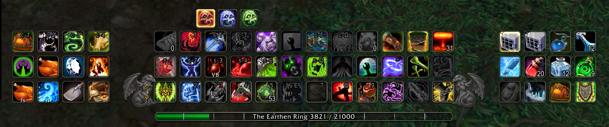

## Actionbar Config

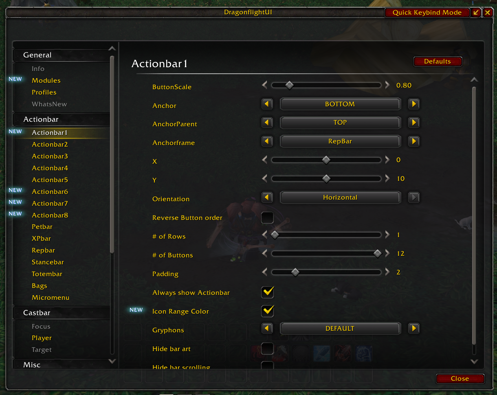

## Castbar

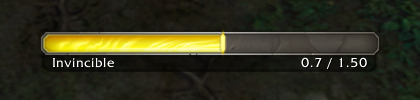

## Darkmode

## Editmode

## Minimap

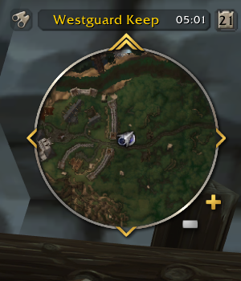

## Micromenu/Bags

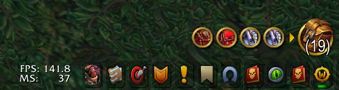

## Quick Keybind

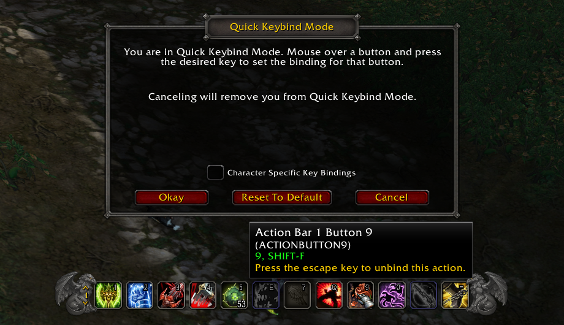

## Tooltip
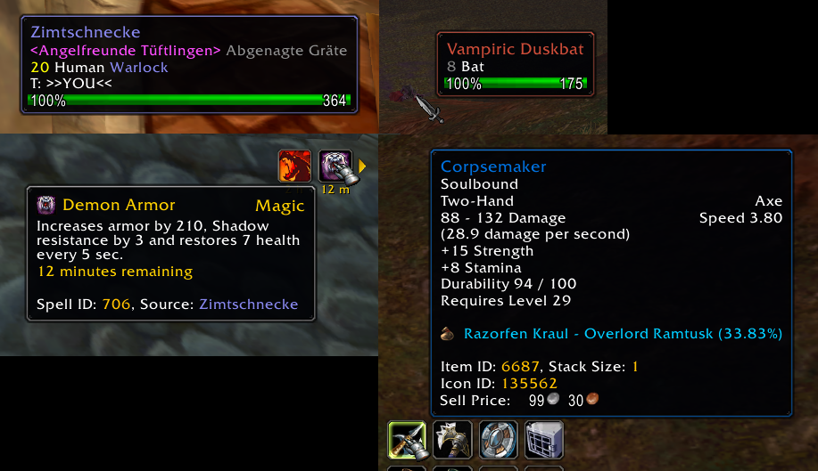

## UI

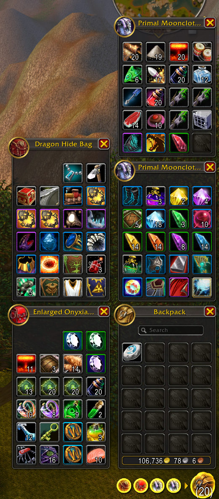

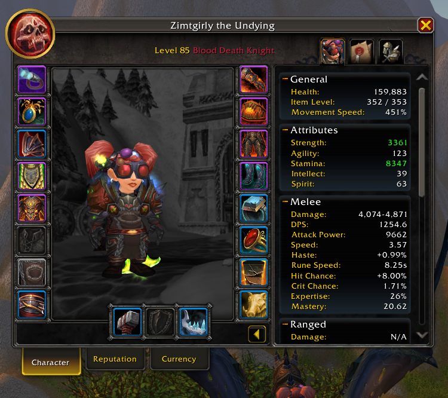

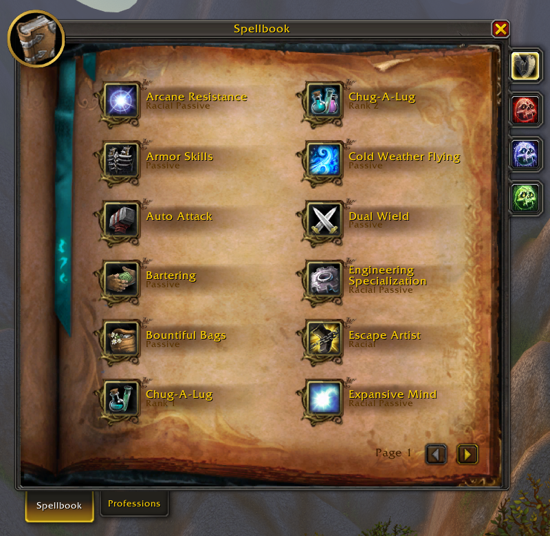

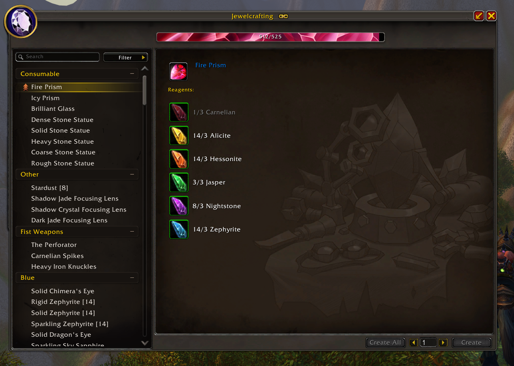

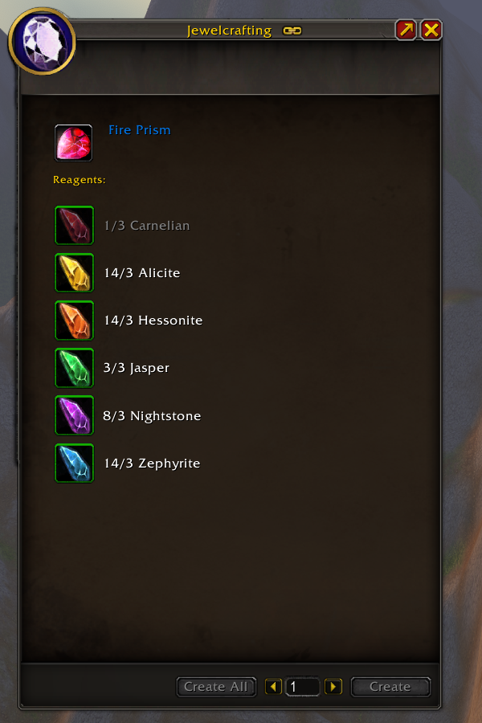

## Unitframe

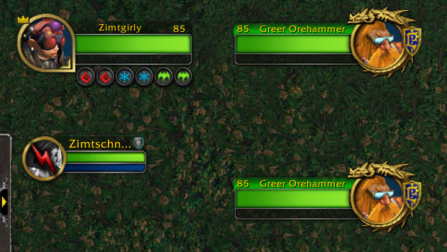

## Complete UI

